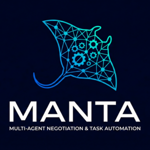

<p align="center">
  
</p>


# **MANTA**
### _**Manta: Multi-Agent Negotiation &amp; Task Automation**_

**MANTA** is a modern, modular, high-performance framework for building autonomous **multi-agent systems** capable of:

•	Automated negotiation

•	Multi-party decision-making

•	Task planning and execution

•	Agent-to-agent interaction protocols

•	Complex workflows with autonomy and cooperation

**Manta** is a modern rewrite and evolution of **NegMAS** with a focus on:

•	production architecture

•	extensibility

•	performance

•	integration with LLMs and agentic frameworks


## Key Features

### Smart Agents
Agents can negotiate, collaborate, and coordinate tasks.

### Negotiation Engine

Supports:

•	bilateral & multilateral negotiation

•	multiple protocols

•	strategy plug-ins

•	domain-agnostic offers & utilities

### Task Automation
Each agent can:

•	plan tasks

•	schedule actions

•	execute workflows

•	collaborate with other agents


### **Extensible Architecture**

Everything is modular:

•	strategies

•	environments

•	agent behaviors

•	negotiation protocols

•	task executors


### **Performance Focuss**
Built with async support and dependency injection where needed.


## Installation
```bash
pip install manta
```

### **Quick Example**
```bash
from manta.core.agent import Agent
from manta.negotiation.protocols import BasicNegotiationProtocol

buyer = Agent(name="Buyer")
seller = Agent(name="Seller")

protocol = BasicNegotiationProtocol(buyer, seller)
result = protocol.run()

print(result)
```

## Contributing

Contributions are welcome!
Open an issue or pull request to help grow autonomous negotiation systems.

## License

MANTA is licensed under the **Apache License 2.0**.

This includes:
- Permission to use, modify, and distribute the software  
- Commercial and private use  
- Patent protection from contributors  
- A NOTICE file with required attributions  

Full license text is available in the `LICENSE` file.
